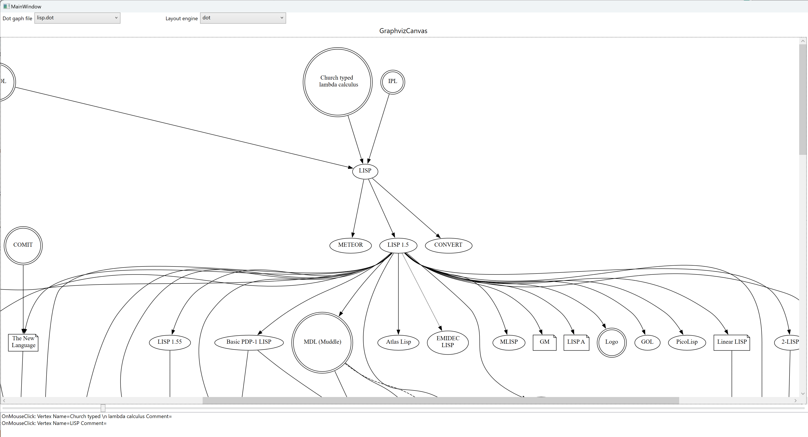

# GraphvizWpf
A WPF control that renders the Graphviz graphs described in the Dot language.<br>
The control allows the creation of interactive graphs by adding mouse-click events, tooltips, and more.


## Limitations
* Only `dashed`, `dotted` and `solid` line styles are supported.
* Specifying an image in a dot file like `vertexName [image="imageName.png"]` is not supported

## How to use
* Copy the Graphviz dlls to the folder with the executable. This can be done by adding a prebuild event to your `csproj` file:
```
<Target Name="DownloadGraphviz" BeforeTargets="BeforeBuild" Condition="!Exists('$(BuildFolder)/Graphviz.zip')">
  <DownloadFile SourceUrl="https://gitlab.com/api/v4/projects/4207231/packages/generic/graphviz-releases/11.0.0/windows_10_cmake_Release_Graphviz-11.0.0-win64.zip" DestinationFolder="$(BuildFolder)" DestinationFileName="Graphviz.zip" />
  <Unzip SourceFiles="$(BuildFolder)Graphviz.zip" DestinationFolder="$(BuildFolder)" />
</Target>
<Target Name="CopyGraphvizBinariesToOutputFolder" AfterTargets="DownloadGraphviz" BeforeTargets="BeforeBuild" Condition="!Exists('$(OutputPath)/config6')">
  <ItemGroup>
    <GraphVizBinaries Include="$(BuildFolder)/Graphviz-*-win64/bin/*.dll;$(BuildFolder)/Graphviz-*-win64/bin/config6" />
  </ItemGroup>
  <Copy SourceFiles="@(GraphVizBinaries)" DestinationFolder="$(OutputPath)" />
</Target>
```
* Look at the example project `Test` from this repository, which shows how to make an interactive zoomable graph.

## How the library works
The GraphvizWpf library uses Graphviz to convert the Dot graph representation to the [Json](https://graphviz.org/docs/outputs/json/) format with the [Dot drawing commands](https://graphviz.org/docs/outputs/canon/#xdot). Then these commands are executed by creating [shapes](https://learn.microsoft.com/en-us/dotnet/api/system.windows.shapes.shape?view=windowsdesktop-8.0) on a [WPF Canvas](https://learn.microsoft.com/en-us/dotnet/desktop/wpf/controls/canvas?view=netframeworkdesktop-4.8)
